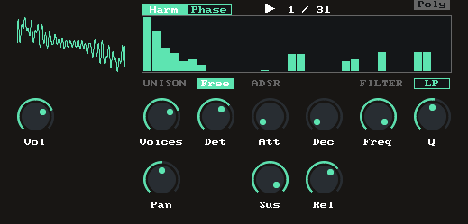

# JSAdditiv

Polyphonic additive synthesizer

Features:
* Wavetable oscillator that reads single cycle waveforms from disk
* Additive synthesis engine that allows to modify the wave
* Wave editors for harmonics amplitude and phase
* 8 voices unison engine
* Polyphony with one adsr envelope per voice
* Mono mode
* Free running and fixed phase osc modes

Available on ReaPack